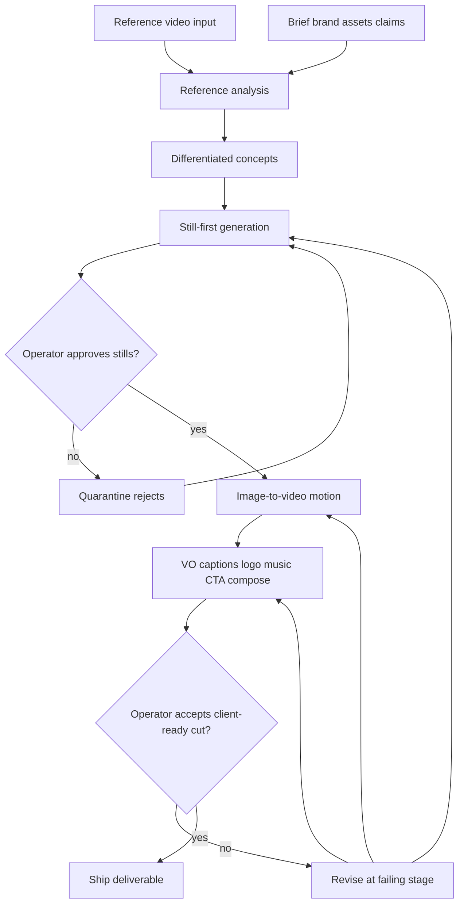
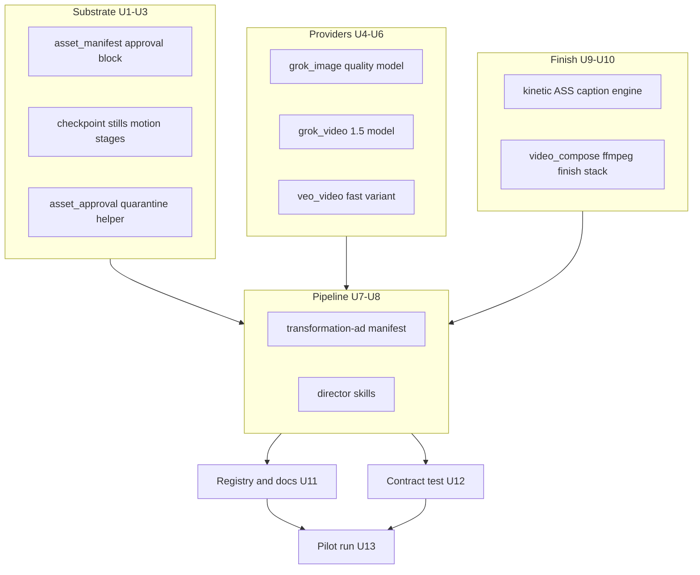

# Transformation Ad Pipeline Modernization - Plan

## Goal Capsule

- **Objective:** Modernize OpenMontage so an agent-driven run can produce a client-ready home-services transformation Reel end-to-end, using reference video(s) for inspiration and the still-first Grok→motion craft rules from the production runbook.
- **Product authority:** This Product Contract. Craft detail for beats, QC, and preferred providers lives in `docs/AI_VIDEO_PRODUCTION_RUNBOOK.md` and `docs/AI_VIDEO_PRODUCTION_SNIPPETS.md` unless this contract overrides.
- **Repo authority:** `AGENT_GUIDE.md` Rule Zero (all production runs through `pipeline_defs/`) and the "Present Both Composition Runtimes (HARD RULE)" banner outrank convenience. A unit that would bypass either is wrong, not clever.
- **Execution:** `code`
- **Execution profile:** Units U1–U12 are repo changes with automated verification. U13 is a live production run that spends provider credits and needs operator playback judgment; it cannot be auto-verified.
- **Stop conditions:** Stop and surface, do not improvise, when (a) a live provider rejects `grok-imagine-image-quality` or `grok-imagine-video-1.5` as unknown model names, (b) the ffmpeg finish stack cannot reproduce the runbook's accepted bathroom cut, or (c) a change would require weakening the still-first gate to make a unit pass.
- **Tail ownership:** The operator owns still, motion, and final-cut approval. Agents own everything between gates, including self-QC before presenting candidates.
- **Open blockers:** None.
- **Product Contract preservation:** Unchanged — no R/F/AE/A ID was added, removed, or reworded; only Outstanding Questions was rewritten to record which KTD resolved each previously-deferred item.

---

## Product Contract

### Summary

NeuraMontage keeps the instruction-driven OpenMontage pipeline system and adds a dedicated transformation-ad pipeline.
The first success is one client-ready vertical transformation Reel: reference-inspired structure, still-first approvals, upgraded critical-path generation, and compose/VO/captions as needed for delivery quality.
Other short-form ad types follow later without rewriting the core.

### Problem Frame

Transformation ads are already produced via a documented still-first process (Grok stills, Grok/Veo motion, VO, captions, logo, music, CTA) outside a fully wired OpenMontage pipeline.
Existing Grok/Veo tools lag the runbook's preferred model names, and no `pipeline_defs` entry encodes home-services transformation production.
That gap shows up as rejected or physically unbelievable clips, reinvented glue per project, and agents that can skip still-first gates.
The operator is the product owner plus AI agents; approval stays with the human.
Quality (fewer bad clips before a shippable cut) is the primary pain; time, credits, and repeatability matter but trail it.

### Key Decisions

- **Keep modernized OpenMontage, not a thin kit.** (session-settled: user-directed — chosen over process-native strip or thin production kit: retain the instruction-driven pipeline system and upgrade it.)
- **Pipeline-first approach.** (session-settled: user-directed — chosen over provider-modernization-first and dual-track thin spine: encode the runbook as a dedicated pipeline; upgrade only critical-path tools for the pilot.)
- **Quality is the primary success signal.** (session-settled: user-directed — chosen over time, credits, or repeatability as primary: fewer rejected/unbelievable clips before a shippable cut.)
- **Operator model: you + agents; you own approval.** (session-settled: user-directed — chosen over production-team or client self-serve.)
- **Pilot genre: home-services transformation Reels first; stay ready for other short-form soon.** (session-settled: user-directed — chosen over genre-only forever or general short-form from day one.)
- **Pilot done bar: client-ready.** (session-settled: user-directed — chosen over internal-proof-only or runbook-parity-without-delivery: would deliver to a real client.)
- **If schedule slips, protect one E2E client-ready transformation ad over broad provider modernization.** (session-settled: user-directed — chosen over finishing many provider upgrades first.)
- **Reference video(s) are first-class pipeline input.** (session-settled: user-directed — added at confirmation: analyze for structure/pacing/style inspiration; produce differentiated concepts, not a carbon copy.)
- **First-ship default (assumption after declined first-ship map):** still-first approval gates + Grok/Veo tools brought in line with runbook preferred models/APIs, packaged as the transformation-ad pipeline; compose on the path when quality needs it.
- **Genre craft stays layered.** Flooring/kitchen/bathroom rules must not hard-lock the pipeline's core identity so other short-form ads can reuse the spine later.

### Actors

- A1. **Operator (product owner)** — supplies brief, brand assets, reference video(s), and approvals at still and delivery gates.
- A2. **Production agent** — runs the pipeline stages, tools, and self-QC under OpenMontage Rule Zero.
- A3. **Generation providers** — image/video (and TTS/music as required for the pilot) called only through approved tools on the critical path.

### Key Flows

- F1. Reference-inspired transformation production
  - **Trigger:** Operator starts a transformation-ad run with brief, assets, and optional reference video URL/file.
  - **Actors:** A1, A2, A3
  - **Steps:** Analyze reference (when present) for structure/pacing/style; present differentiated concepts; generate and approve stills before any motion; animate only approved stills with preferred I2V path; assemble VO/captions/brand/CTA; operator accepts or rejects the cut.
  - **Outcome:** A vertical ~30–40s transformation Reel the operator would deliver to a client, or an explicit reject with quarantined evidence.
  - **Covered by:** R1–R8, R11

- F2. Still rejection and quarantine
  - **Trigger:** Operator or agent QC rejects a still or motion clip.
  - **Actors:** A1, A2
  - **Steps:** Do not silently overwrite; quarantine rejected work; regenerate only what failed; never animate an unapproved still.
  - **Outcome:** Rejected work preserved; credits not spent animating unapproved plates.
  - **Covered by:** R3, R4, R9

### Requirements

**Pipeline and reference input**

- R1. A dedicated transformation-ad pipeline exists in the OpenMontage pipeline system and is the required path for this production type (Rule Zero).
- R2. The pipeline accepts reference video(s) as optional but first-class input; when provided, the agent must run reference analysis and use it for structure/pacing/style inspiration before locking the production plan.
- R3. Reference use produces differentiated concepts inspired by the reference, not a frame-level carbon copy.

**Still-first craft and quality**

- R4. No motion generation may run against a still that the operator has not approved.
- R5. Process shots prioritize credible close work on the person/task; wide plates are reserved for before/after reveals per runbook craft rules.
- R6. Generated actions must be physically believable for the specific remodel; operator playback judgment overrides auxiliary vision QC when they conflict.
- R7. Every moving clip is unique, native speed, used once — no loops, freezes, repeated tails, or slowed footage hiding coverage gaps.

**Providers and compose**

- R8. Critical-path image and video tools support the runbook's preferred generation models/APIs for the pilot (Grok image quality path; Grok I2V preferred with Veo as alternate when people motion fails).
- R9. Rejected stills and clips are quarantined and preserved; they are not silently deleted or overwritten.
- R10. Compose/assembly (VO, kinetic captions, logo, music, CTA, final mux) is in scope when required to reach a client-ready cut for the pilot.

**Readiness beyond the first genre**

- R11. Pipeline identity and stage contracts stay usable for other short-form ads later; home-services/remodel craft rules are layered guidance, not the only valid path through the spine.
- R12. Broad upgrades of non-critical providers are desirable stretch after the pilot ad ships; they must not gate the client-ready transformation deliverable.

### Acceptance Examples

- AE1. Reference present
  - **Covers:** R2, R3
  - **Given:** Operator supplies a reference Reel URL and a flooring transformation brief.
  - **When:** The agent completes the idea/proposal stage.
  - **Then:** The run includes a grounded reference summary and 2–3 differentiated concepts that are not a carbon copy; production proceeds only after operator concept approval.

- AE2. Still-first gate
  - **Covers:** R4, R9
  - **Given:** Stills for before/process/after are generated but not yet approved.
  - **When:** The agent attempts image-to-video.
  - **Then:** Motion is blocked until stills are approved; any rejected still is quarantined, not overwritten.

- AE3. Client-ready pilot
  - **Covers:** R1, R8, R10
  - **Given:** A complete brief, assets, credentials, and approvals through the pipeline.
  - **When:** The run finishes.
  - **Then:** Output is a vertical transformation Reel the operator would deliver to a real client, including beat-aligned VO/captions/brand/CTA as required by the brief.

- AE4. Schedule pressure
  - **Covers:** R12
  - **Given:** Time remains only for either finishing the E2E transformation path or upgrading many unused providers.
  - **When:** Scope is cut.
  - **Then:** The E2E client-ready transformation path is protected; unused-provider upgrades wait.

### Success Criteria

- One home-services transformation Reel produced through the new pipeline that the operator judges client-ready.
- Measurable drop in rejected/unbelievable clips versus the prior ad-hoc runbook path for a comparable brief (operator judgment is the scoreboard).
- Reference-driven runs always show analysis + differentiated concepts before spend on stills/motion when a reference was provided.
- Other OpenMontage pipelines remain usable; unused ones are not deleted as part of this work.

### Scope Boundaries

**In scope for first ship**

- Transformation-ad pipeline encoding still-first gates and runbook craft.
- Reference video input and inspired-by analysis.
- Critical-path provider/model/API alignment for the pilot (Grok + Veo alternate; TTS/music as required).
- Compose/assembly work needed for client-ready quality.

**Deferred for later**

- Client self-serve UI / dashboard.
- Heavy pruning or deletion of unused OpenMontage pipelines/skills (after a successful pilot).
- Broad modernization of every legacy video provider as a first-ship gate.
- Non–home-services short-form genres as the first pilot deliverable (system must stay ready; genre expansion follows the pilot).

**Outside this product's identity**

- Replacing OpenMontage's instruction-driven pipeline model with a script-only video-poc toolkit.
- Carbon-copy cloning of competitor reference ads as the default creative mode.

### Dependencies / Assumptions

- Operator has provider credentials and billing for Grok/Gemini (and TTS/music used on the pilot) available in the runtime environment; keys are never committed to the repo.
- `docs/AI_VIDEO_PRODUCTION_RUNBOOK.md` and `docs/AI_VIDEO_PRODUCTION_SNIPPETS.md` remain the craft/source authority for beats, QC, and preferred model names unless superseded here.
- OpenMontage already has Grok image/video and Veo tools and cinematic/hybrid pipelines; this work adds a transformation path and brings critical tools to runbook parity rather than inventing generation from zero.
- NAS/durable project layout and brand asset intake follow the runbook's project conventions unless planning chooses an equivalent durable layout.
- Assumption (first-ship map declined): first ship = still-first gates + Grok/Veo runbook alignment + transformation pipeline packaging; not a full-repo modernization pass.

### Outstanding Questions

**Blocking**

_None._

**Deferred (non-blocking)**

- Whether the live xAI API accepts `grok-imagine-image-quality` and `grok-imagine-video-1.5` under the current account tier. Resolved empirically in U13's first live call; U4 and U5 keep the prior model names in each enum so a rejection is a one-field override, not a rollback.
- Which TTS provider carries the pilot VO. The runbook documents both a Fish Audio path and an ElevenLabs path; only `tools/audio/elevenlabs_tts.py` exists in-repo, so the pilot uses ElevenLabs and Fish stays a post-pilot option.
- Stretch backlog order for non-critical provider upgrades after the pilot ships (KTD-11).

The six items previously deferred to planning are resolved: stage list (KTD-1), reference-analysis binding (KTD-2), compose runtime presentation (KTD-8), model enum versus agent override (KTD-5), Veo backend choice (KTD-6), and stretch backlog ordering (KTD-11).

### Sources / Research

- Craft and process: `docs/AI_VIDEO_PRODUCTION_RUNBOOK.md`, `docs/AI_VIDEO_PRODUCTION_SNIPPETS.md`
- Rule Zero / pipeline mandate: `AGENT_GUIDE.md` (production through `pipeline_defs/`)
- Existing pipelines (no transformation-ad entry): `pipeline_defs/` (`cinematic`, `hybrid`, and others)
- Grok image tool currently enums/defaults `grok-imagine-image` (lags runbook `grok-imagine-image-quality`): `tools/graphics/grok_image.py`
- Grok video tool currently enums/defaults `grok-imagine-video` (lags runbook `grok-imagine-video-1.5`): `tools/video/grok_video.py`
- Veo tool supports `image_to_video`: `tools/video/veo_video.py`
- Reference-video entry point already exists in OpenMontage guidance: `AGENT_GUIDE.md` (Reference Video Entry Point) and related meta skills

---

## Planning Contract

### Key Technical Decisions

- KTD-1. **Split the canonical `assets` stage into two gated stages, `stills` and `motion`.** Both produce `asset_manifest`. The still-first rule (R4) needs a hard stop between plate approval and motion spend, and OpenMontage only enforces gates at stage boundaries: `lib/checkpoint.py` raises `CheckpointValidationError` when a stage with `human_approval_default: true` is written `completed` without `human_approved=True`, and `get_next_stage` will not advance past an unfinished stage. A `sub_stage` inside `assets` carries no such enforcement, so it would leave R4 as prose. Full stage order: `research → proposal → idea → script → scene_plan → stills → motion → edit → compose → publish`. (Instantiates the Product Contract's still-first Key Decision.)

- KTD-2. **Bind reference analysis through the manifest's existing `reference_input` block plus the `video_analysis_brief` artifact, not a new stage.** `lib/checkpoint.py` already lists `video_analysis_brief` in `SUPPLEMENTARY_ARTIFACTS` as a "reference-video grounding artifact carried alongside stages", and `pipeline_defs/cinematic.yaml` shows the `reference_input` shape (`supported`, `analysis_depth`, `analysis_tools`). Reference work lands in `research` and feeds `proposal`, which keeps `AGENT_GUIDE.md`'s Reference Video Entry Point as the single workflow instead of forking it. (session-settled: user-directed — chosen over a dedicated reference stage: reference videos are first-class input, and the repo already carries them as a cross-stage artifact.)

- KTD-3. **Record still/motion approval inside `asset_manifest` as an additive per-asset `approval` object.** Asset items are `additionalProperties: false`, so `approval_state` cannot be bolted on ad hoc. The existing `voice_performance` sub-object (with `sample_approved`, `sample_path`, `review_notes`) is the in-repo precedent for exactly this shape. Additive properties keep every existing manifest valid, so no other pipeline is touched.

- KTD-4. **Quarantine by move-and-record, never delete.** A rejected asset moves under the project's `quarantine/` directory and the manifest entry keeps `approval.state: "rejected"` with `approval.quarantine_path`; its replacement records `approval.supersedes`. This satisfies R9 with evidence that survives in the stage checkpoint, since `write_checkpoint` archives superseded checkpoints into `history/`.

- KTD-5. **Extend the Grok model enums rather than documenting an agent override.** `tools/graphics/grok_image.py` declares `"enum": ["grok-imagine-image"]` and `tools/video/grok_video.py` declares `"enum": ["grok-imagine-video"]`; a closed enum means an agent physically cannot select the runbook models. Extending the enum and moving the default is the only path that reaches R8. Prior names stay in each enum as the fallback the pipeline can select if the account rejects the newer model.

- KTD-6. **Veo alternate path runs on the Google GenAI backend, not fal.** The runbook names `veo-3.1-fast-generate-preview`, a Google GenAI model id. `tools/video/veo_video.py` has no enum on `model_variant`, and its Google branch passes any unrecognized variant through verbatim, so the runbook model works today with `backend: "google"` and no schema change. The fal path takes fal-specific slugs and cannot express that model. The existing `veo3.1/fast` alias is fixed to resolve to the fast model rather than silently falling back to the non-fast preview.

- KTD-7. **`veo_video` is the declared alternate, not a silent fallback.** Switching to Veo when Grok I2V fails people motion is a recorded decision at the `motion` stage, not an automatic retry. A silent provider swap would hide the exact failure signal R6 depends on.

- KTD-8. **Lock `render_runtime: "ffmpeg"` for the pilot, with Remotion and HyperFrames presented and recorded as rejected.** The runbook's accepted cut is a single FFmpeg filtergraph (ASS/libass kinetic captions, persistent logo, VO, music, end-card band, `tpad` extension, ~-14 LUFS), and `tools/video/video_compose.py` already burns ASS with a `force_style` string. Remotion would require re-authoring kinetic typography as React components; `skills/core/hyperframes.md` lists caption-burn parity as deferred repo-wide. Per `AGENT_GUIDE.md`'s "Present Both Composition Runtimes (HARD RULE)", the proposal stage still surfaces all three and writes a `render_runtime_selection` decision with both rejections and reasons — a single-option decision log is a CRITICAL reviewer finding per `skills/meta/reviewer.md`.

- KTD-9. **Build the kinetic ASS caption engine as an in-repo tool.** `tools/subtitle/subtitle_gen.py` emits `srt`, `vtt`, and `json` only; the runbook's caption layer (phrase segmentation, emphasis pop, safe-zone placement, end-card events keyed to VO end) has no in-repo equivalent and the referenced `caption_engine.py` lives outside this repo. R10 cannot be met by configuration alone.

- KTD-10. **The pipeline spine stays genre-neutral; remodel craft lives in the director skills.** Stage names, artifacts, and gates carry no flooring/kitchen/bathroom vocabulary, so a later short-form ad genre reuses the spine by swapping director skills (R11). Home-services specifics live in `skills/pipelines/transformation-ad/*.md` playbook prose.

- KTD-11. **Stretch backlog order after the pilot ships:** (1) Fish Audio TTS path from the runbook, (2) HyperFrames caption parity so the transformation pipeline gains a second real runtime, (3) remaining legacy video providers. Ordered by distance from the transformation critical path, honoring R12.

### High-Level Technical Design

Stage-to-runbook mapping for `pipeline_defs/transformation-ad.yaml`:

| Stage | Runbook source | Canonical artifact | Gated |
|---|---|---|---|
| `research` | Stage 1 evidence-first reference and brand research | `research_brief` (+ `video_analysis_brief`) | no |
| `proposal` | Stage 2 concept and approval packet | `proposal_packet` | yes |
| `idea` | Stages 3–4 brand YAML, canonical setting, situational brief | `brief` | no |
| `script` | Stage 10.1 one short line per beat | `script` | no |
| `scene_plan` | Stages 5–6 identity/logo conditioning, shot plan | `scene_plan` | no |
| `stills` | Stage 7 still-first generation and self-QC | `asset_manifest` | yes |
| `motion` | Stage 8 motion generation and motion QC | `asset_manifest` | yes |
| `edit` | Stages 9–10 clean cut plus beat-aligned VO | `edit_decisions` | no |
| `compose` | Stages 11–12 captions, end card, final render | `render_report` | yes |
| `publish` | Stage 13 QA and delivery | `publish_log` | no |

### Implementation Constraints

- Additive schema changes only. Existing artifacts across other pipelines must keep validating; no property is removed or made required.
- No new absolute paths. The runbook's code references point at an external `video-poc` checkout; ported logic lives under `tools/` and is cited repo-relatively.
- Gate enforcement stays in `lib/checkpoint.py`. Director skills describe the gate; they never re-implement it.
- Provider model changes keep the schema `default` and the code-level default in sync — `tests/tools/test_provider_model_defaults.py` documents this exact class of bug for `runway_video`/`higgsfield_video`.
- `tests/contracts/test_runtime_presentation_contract.py` runs against every file in `pipeline_defs/`, so the new manifest's `proposal` and `compose` skills must exist and carry the runtime tokens the day the manifest lands.

### Sequencing

1. Substrate: U1 → U2 → U3.
2. Providers: U4, U5, U6 in parallel with the substrate.
3. Finish stack: U9 → U10.
4. Pipeline packaging: U7 → U8 (needs stage names from U2 and tool names from U4–U6, U9–U10).
5. Wiring and proof: U11, U12 after U7/U8.
6. Pilot: U13 last.

Schedule-pressure order per R12: units U1–U13 are the protected path. Nothing in KTD-11's stretch backlog starts before U13 delivers.

### System-Wide Impact

- `schemas/artifacts/asset_manifest.schema.json` is shared by every pipeline. The `approval` block is optional, so existing producers are unaffected, but any tool that round-trips manifests must preserve unknown-to-it properties rather than rebuilding the dict.
- `lib/checkpoint.py`'s `CANONICAL_STAGE_ARTIFACTS` gains `stills` and `motion`. Both map to `asset_manifest`, so the project's `asset_manifest.json` is written twice in a run; the stills-stage copy survives in the stage checkpoint and in `history/`.
- Grok default-model changes alter cost estimates for any existing caller that omits `model`. Both tools' `estimate_cost`/`estimate_runtime` must move with the default.
- The Backlot board builds its stage rail from the manifest, so `stills` and `motion` appear without a Backlot change; `tests/contracts/test_backlot_contract.py` is the guard.

### Risks & Dependencies

| Risk | Mitigation |
|---|---|
| xAI rejects `grok-imagine-image-quality` / `grok-imagine-video-1.5` for this account | Prior model names stay in both enums; the pipeline can select the older model with one field, and U13 discovers this on the first live call |
| Ported ASS caption engine drifts from the runbook's accepted look | U9 reproduces the runbook's bathroom cut timings as a fixture test before U13 spends credits |
| Two stages writing `asset_manifest.json` confuses a downstream reader | Motion-stage manifest is a superset of the stills-stage manifest; stills evidence is preserved in its own checkpoint |
| Veo Google backend needs credentials the operator may not have configured | `tools/video/veo_video.py` already resolves `backend: "auto"` by credential presence; U6 surfaces the fal limitation instead of silently degrading |
| FFmpeg finish stack scope creeps into a general compositor | U10 targets exactly the runbook's filter stack: logo overlay, ASS burn, VO+music mix, `tpad` end card, loudnorm |

---

## Implementation Units

| U-ID | Title | Files touched | Depends on |
|---|---|---|---|
| U1 | Asset approval provenance in `asset_manifest` | `schemas/artifacts/asset_manifest.schema.json` | — |
| U2 | Register `stills` and `motion` stages | `lib/checkpoint.py` | U1 |
| U3 | Quarantine and supersede helper | `lib/asset_approval.py` | U1 |
| U4 | Grok image model parity | `tools/graphics/grok_image.py` | — |
| U5 | Grok video model parity | `tools/video/grok_video.py` | — |
| U6 | Veo fast-variant mapping and backend guidance | `tools/video/veo_video.py` | — |
| U7 | Transformation-ad pipeline manifest | `pipeline_defs/transformation-ad.yaml` | U2, U4, U5, U9, U10 |
| U8 | Transformation-ad director skills | `skills/pipelines/transformation-ad/` | U7 |
| U9 | Kinetic ASS caption engine | `tools/subtitle/kinetic_captions.py` | — |
| U10 | FFmpeg finish stack in compose | `tools/video/video_compose.py` | U9 |
| U11 | Registry and documentation wiring | `AGENT_GUIDE.md`, `skills/INDEX.md`, `skills/core/hyperframes.md`, `docs/ARCHITECTURE.md`, `PROJECT_CONTEXT.md` | U7, U8 |
| U12 | Pipeline contract test | `tests/contracts/test_transformation_ad_pipeline.py` | U7, U8 |
| U13 | Pilot transformation Reel run | project workspace only | U1–U12 |

### U1. Asset approval provenance in `asset_manifest`

- **Goal:** Give every generated still and clip a machine-readable approval state so the still-first gate and quarantine leave evidence in the artifact.
- **Requirements:** R4, R9
- **Files:** `schemas/artifacts/asset_manifest.schema.json`; new `tests/lib/test_asset_manifest_approval.py`
- **Approach:** Add an optional `approval` object to the asset item schema, mirroring the existing `voice_performance` sub-object shape (`additionalProperties: false`, all properties optional). Properties: `state` (enum `pending` / `approved` / `rejected`), `approved_by`, `approved_at`, `review_notes`, `quarantine_path`, `supersedes`. Change nothing else — `required` stays `["id", "type", "path", "source_tool", "scene_id"]`.
- **Test Scenarios:** A manifest with no `approval` key still validates. A manifest with a full `approval` object validates. An unknown key inside `approval` fails validation. An unknown `state` value fails validation.
- **Verification:** `.venv/bin/python -m pytest tests/lib/test_asset_manifest_approval.py -v` and `.venv/bin/python -m pytest tests/ -k asset_manifest -v` (no existing manifest fixture regresses).

### U2. Register `stills` and `motion` stages

- **Goal:** Make `stills` and `motion` first-class gated stages so a checkpoint written at `stills` cannot complete without operator approval and cannot be skipped on the way to `motion`.
- **Requirements:** R1, R4
- **Files:** `lib/checkpoint.py`; new `tests/lib/test_still_first_gate.py`
- **Approach:** Add `"stills": "asset_manifest"` and `"motion": "asset_manifest"` to `CANONICAL_STAGE_ARTIFACTS`. Leave `ALL_KNOWN_STAGES` and `STAGES` alone — they are the no-manifest fallback, and `character-animation` sets the precedent that custom stages stay out of them. Gate behavior needs no new code: `_stage_requires_approval` reads `human_approval_default` from the manifest and `write_checkpoint` already raises on a gated stage completed without `human_approved=True`.
- **Test Scenarios:** Writing `stills` as `completed` without `human_approved` raises `CheckpointValidationError`. Writing `stills` as `awaiting_human` without an `asset_manifest` raises. Writing `stills` `completed` with approval and a manifest succeeds. `get_next_stage` returns `stills` while `stills` is unfinished and `motion` only after it completes.
- **Verification:** `.venv/bin/python -m pytest tests/lib/test_still_first_gate.py -v`

### U3. Quarantine and supersede helper

- **Goal:** One shared implementation of "reject an asset without losing it", so no project reinvents the glue.
- **Requirements:** R9
- **Files:** new `lib/asset_approval.py`; new `tests/lib/test_asset_approval.py`
- **Approach:** Provide `quarantine_asset(manifest, asset_id, project_dir, reason)` and `approve_asset(manifest, asset_id, approved_by, notes)`. `quarantine_asset` moves the file under `<project_dir>/quarantine/<stage>/` , sets `approval.state = "rejected"`, records `quarantine_path` and `review_notes`, and returns the updated manifest. `record_replacement(manifest, new_asset_id, supersedes_id)` sets `approval.supersedes`. The helper never deletes and raises when the destination already exists rather than overwriting.
- **Test Scenarios:** Quarantining moves the file and leaves the original path empty. Quarantining twice raises rather than clobbering. The returned manifest validates against the U1 schema. Approving sets `state`, `approved_by`, and `approved_at`.
- **Verification:** `.venv/bin/python -m pytest tests/lib/test_asset_approval.py -v`

### U4. Grok image model parity

- **Goal:** Let the pipeline select the runbook's preferred image model, which today's closed enum forbids.
- **Requirements:** R8
- **Files:** `tools/graphics/grok_image.py`; new `tests/tools/test_grok_model_parity.py`
- **Approach:** Extend the `model` enum to `["grok-imagine-image-quality", "grok-imagine-image"]`, move `default` to `grok-imagine-image-quality`, and update the code-level fallback at the `inputs.get("model", ...)` call so schema and code agree. Move `estimate_cost`/`estimate_runtime` with the default. Keep the older name available as the account-tier fallback named in Outstanding Questions.
- **Test Scenarios:** Schema `default` equals the code fallback. `estimate_cost({})` equals `estimate_cost({"model": schema_default})`. The prior model name still validates as an allowed enum value.
- **Verification:** `.venv/bin/python -m pytest tests/tools/test_grok_model_parity.py tests/tools/test_provider_model_defaults.py -v`

### U5. Grok video model parity

- **Goal:** Let the `motion` stage call the runbook's preferred image-to-video model.
- **Requirements:** R8
- **Files:** `tools/video/grok_video.py`; `tests/tools/test_grok_model_parity.py`
- **Approach:** Extend the `model` enum to `["grok-imagine-video-1.5", "grok-imagine-video"]` and move `default` to `grok-imagine-video-1.5`. Update the hardcoded fallback in the payload construction and in cost/runtime estimation. The runbook keeps `grok-imagine-video` for broader reference-to-video needs, so it stays selectable and `operation: "reference_to_video"` keeps working.
- **Test Scenarios:** Schema `default` equals the code fallback. `image_to_video` with no explicit `model` builds a payload naming `grok-imagine-video-1.5`. `reference_to_video` with `model: "grok-imagine-video"` still validates.
- **Verification:** `.venv/bin/python -m pytest tests/tools/test_grok_model_parity.py -v`

### U6. Veo fast-variant mapping and backend guidance

- **Goal:** Make the documented alternate path reach `veo-3.1-fast-generate-preview` instead of silently resolving to the slower preview model.
- **Requirements:** R8
- **Files:** `tools/video/veo_video.py`; new `tests/tools/test_veo_variant_mapping.py`
- **Approach:** In the Google-backend model resolution, map `veo3.1/fast` and `veo3/fast` to `veo-3.1-fast-generate-preview` rather than collapsing every `veo3.1*` alias to the non-fast id. Leave `model_variant` enum-free so the runbook's exact model id passes through verbatim. Document in the tool docstring that the runbook's alternate path is `backend: "google"`, since fal takes fal-specific slugs.
- **Test Scenarios:** `model_variant: "veo3.1/fast"` on the Google backend resolves to `veo-3.1-fast-generate-preview`. `model_variant: "veo3.1"` still resolves to the existing non-fast id. A verbatim `veo-3.1-fast-generate-preview` passes through unchanged. `estimate_cost` picks the fast tier for both spellings.
- **Verification:** `.venv/bin/python -m pytest tests/tools/test_veo_variant_mapping.py -v`

### U7. Transformation-ad pipeline manifest

- **Goal:** Satisfy Rule Zero with a manifest that encodes the runbook's stage order, gates, and reference input.
- **Requirements:** R1, R2, R4, R11
- **Files:** new `pipeline_defs/transformation-ad.yaml`
- **Approach:** Author the manifest against `schemas/pipelines/pipeline_manifest.schema.json` with `category: custom`, `stability: beta`, and `default_checkpoint_policy: guided`. Stage order and gates follow the KTD-1 table. Set `reference_input` with `supported: true`, `analysis_depth: deep`, and the `video_analyzer` / `transcript_fetcher` / `video_downloader` / `scene_detect` / `frame_sampler` tool list used by `pipeline_defs/cinematic.yaml`. Give `stills`, `motion`, `proposal`, and `compose` `human_approval_default: true`. Give `edit` sub-stages for the clean cut and the beat-aligned VO sample. Populate `tools_available` per stage from the U4–U6 and U9–U10 tool names. Keep every stage name and `review_focus` line genre-neutral per KTD-10.
- **Test Scenarios:** The manifest validates against the pipeline schema. `get_stage_order` returns the ten stages in KTD-1 order. `load_pipeline_readonly("transformation-ad")` resolves. Every stage `skill:` reference points at a file created in U8.
- **Verification:** `.venv/bin/python -m pytest tests/contracts/test_runtime_presentation_contract.py -v` (it parametrizes over every manifest in `pipeline_defs/`) and `make test-contracts`.

### U8. Transformation-ad director skills

- **Goal:** Give each stage the instruction contract an agent needs, including the runtime conversation the repo enforces.
- **Requirements:** R2, R3, R4, R5, R6, R7, R9, R10, R11
- **Files:** new `skills/pipelines/transformation-ad/` — `executive-producer.md`, `research-director.md`, `proposal-director.md`, `idea-director.md`, `script-director.md`, `scene-director.md`, `stills-director.md`, `motion-director.md`, `edit-director.md`, `compose-director.md`, `publish-director.md`
- **Approach:** Model the file set on `skills/pipelines/clip-factory/`. `proposal-director.md` carries the runtime contract: name `render_runtime`, name `hyperframes`, present all three runtimes, and write a `render_runtime_selection` decision recording `remotion` and `hyperframes` as rejected with the KTD-8 reasons. `compose-director.md` routes by `render_runtime` and names HyperFrames explicitly. `stills-director.md` encodes the runbook's seven-point still QC list and forbids batch-generating motion off rejected stills. `motion-director.md` encodes the motion QC list, the one-action/camera/continuity prompt shape, the unique-clip rule (R7), and the Veo escalation as a recorded decision (KTD-7). `research-director.md` runs reference analysis and produces `video_analysis_brief`; `proposal-director.md` requires 2–3 differentiated concepts and forbids frame-level copying (R3). Home-services craft stays in playbook prose inside these files, not in stage or artifact names.
- **Test Scenarios:** `tests/contracts/test_runtime_presentation_contract.py` passes for `transformation-ad` on both the planning-skill and compose-skill assertions. Every `skill:` string in the manifest resolves to an existing file. `stills-director.md` states the gate in terms of the checkpoint protocol (`awaiting_human`, end turn, then `completed` with `human_approved=True`).
- **Verification:** `make test-contracts`

### U9. Kinetic ASS caption engine

- **Goal:** Produce the runbook's kinetic brand typography and end card as an ASS file, which no in-repo tool can do today.
- **Requirements:** R10
- **Files:** new `tools/subtitle/kinetic_captions.py`; new `tests/tools/test_kinetic_captions.py`
- **Approach:** New tool registered with the existing tool-registry pattern used by `tools/subtitle/subtitle_gen.py`. Inputs: word-level alignment, beat boundaries, brand string, VO end time, safe-zone geometry, and end-card copy. Behavior per the runbook's caption section: segment phrases from alignment, keep the brand inside one phrase, apply emphasis color/pop tags, place in the lower-middle safe zone, insert real time gaps between beat lines so phrases do not merge, and start end-card events at VO end rather than the video tail. Output an ASS file path plus the event list for QA.
- **Test Scenarios:** Phrase segmentation keeps a multi-word brand in one event. Two beats separated by a gap produce two events, not one merged event. End-card events start at the supplied VO end. Emitted ASS parses with `ffprobe`. Rendering the runbook's accepted bathroom timings reproduces the documented beat boundaries.
- **Verification:** `.venv/bin/python -m pytest tests/tools/test_kinetic_captions.py -v`

### U10. FFmpeg finish stack in compose

- **Goal:** Render the client-ready mux — logo, captions, VO, music, end card, loudness — on the runtime KTD-8 locks.
- **Requirements:** R7, R10
- **Files:** `tools/video/video_compose.py`; new `tests/tools/test_ffmpeg_finish_stack.py`
- **Approach:** Extend the existing `ffmpeg` render path from concat/trim to the runbook's finish stack: persistent logo overlay, ASS burn via the existing `force_style` path, VO plus music mix, `tpad=stop_mode=clone` used only for the declared post-VO card extension, final duration set to VO end plus card duration, and `loudnorm` at roughly -14 LUFS. Do not pass `-shortest` when it could truncate the end card. Reject inputs that would repeat, freeze, or slow a clip to pad runtime, so R7 is enforced by the tool and not only by prose.
- **Test Scenarios:** Final duration equals VO end plus card duration. The built command contains no `-shortest` when an end card is present. A manifest reusing the same clip id twice is rejected with a clear error. The ASS filter receives the U9 output path. Audio output measures near the target LUFS on a synthetic fixture.
- **Verification:** `.venv/bin/python -m pytest tests/tools/test_ffmpeg_finish_stack.py -v` and `.venv/bin/python -m pytest tests/tools -k compose -v`

### U11. Registry and documentation wiring

- **Goal:** Make the pipeline discoverable by a fresh-session agent that reads only the repo's index documents.
- **Requirements:** R1, R11
- **Files:** `AGENT_GUIDE.md`, `skills/INDEX.md`, `skills/core/hyperframes.md`, `docs/ARCHITECTURE.md`, `PROJECT_CONTEXT.md`
- **Approach:** Add `transformation-ad` to the pipeline table in `AGENT_GUIDE.md` with a one-line "Home-services before/after transformation ads" description and `beta` stability. Add the director-skill rows to `skills/INDEX.md` following the clip-factory block's shape. Add a row to the "Pipelines adopting HyperFrames" table in `skills/core/hyperframes.md` marking it deferred with the caption-parity reason from KTD-8. Add the pipeline to the tables in `docs/ARCHITECTURE.md` and `PROJECT_CONTEXT.md`.
- **Test Scenarios:** The `AGENT_GUIDE.md` pipeline table lists `transformation-ad`. `skills/core/hyperframes.md` names the pipeline with a stated runtime status. No index still implies `assets` is the only asset-producing stage for this pipeline.
- **Verification:** `make test-contracts` and `rg -n "transformation-ad" AGENT_GUIDE.md skills/INDEX.md skills/core/hyperframes.md docs/ARCHITECTURE.md PROJECT_CONTEXT.md`

### U12. Pipeline contract test

- **Goal:** Lock the stage order, gates, and required tools so a later edit cannot quietly remove the still-first gate.
- **Requirements:** R1, R4, R8, R9
- **Files:** new `tests/contracts/test_transformation_ad_pipeline.py`
- **Approach:** Model on `tests/contracts/test_character_animation_pipeline.py`. Assert `get_stage_order` matches the KTD-1 order, that `stills` and `motion` carry `human_approval_default: true`, that `reference_input.supported` is true with `video_analyzer` in the tool list, that the Grok and Veo tools plus the U9 caption tool are discoverable in the registry, and that a simulated still-then-motion flow enforces the gate through `write_checkpoint`.
- **Test Scenarios:** Stage-order assertion fails if a stage is reordered or dropped. Gate assertion fails if `human_approval_default` is removed from `stills`. A simulated motion checkpoint written before the stills gate raises.
- **Verification:** `.venv/bin/python -m pytest tests/contracts/test_transformation_ad_pipeline.py -v`

### U13. Pilot transformation Reel run

- **Goal:** Prove the pipeline by shipping one home-services transformation Reel the operator would send to a real client.
- **Requirements:** R1–R10
- **Files:** none in-repo; project workspace artifacts only
- **Approach:** Run the pipeline end to end on a real brief with a reference Reel. Take the operator gate at `proposal`, `stills`, `motion`, and `compose`. Record the `render_runtime_selection` decision with both rejected runtimes. Quarantine every reject through the U3 helper. On the first live Grok call, confirm the runbook model names are accepted; if either is rejected, select the prior enum value, record the substitution as a decision, and note the account-tier finding for the deferred question. Watch the final MP4 at normal speed before delivery, per the runbook's manual QA list.
- **Test Scenarios:** Not automatable. The operator's playback judgment is the verdict (R6).
- **Verification:** Final MP4 exists with its full path recorded, the operator states it is client-ready, checkpoints show approvals at all four gates, and `quarantine/` holds every rejected asset referenced by `approval.quarantine_path`.

---

## Verification Contract

| Command | Applies to | Gate |
|---|---|---|
| `.venv/bin/python -m pytest tests/lib/test_asset_manifest_approval.py tests/lib/test_still_first_gate.py tests/lib/test_asset_approval.py -v` | U1, U2, U3 | Still-first substrate is enforced in code |
| `.venv/bin/python -m pytest tests/tools/test_grok_model_parity.py tests/tools/test_veo_variant_mapping.py tests/tools/test_provider_model_defaults.py -v` | U4, U5, U6 | Runbook models are selectable and defaults match schema |
| `.venv/bin/python -m pytest tests/tools/test_kinetic_captions.py tests/tools/test_ffmpeg_finish_stack.py -v` | U9, U10 | Finish stack reproduces the runbook's caption and mux rules |
| `make test-contracts` | U7, U8, U11, U12 | Pipeline, skills, runtime presentation, and Backlot contracts hold |
| `make test` | all | Full suite; no other pipeline regressed |
| `make preflight` | U4, U5, U6, U9 | Registry discovers the changed and new tools |
| Operator playback of the final MP4 | U13 | Client-ready verdict (R6) |

Quality gates that are not test commands:

- The `render_runtime_selection` decision in the pilot run lists more than one option. A single-option decision is a CRITICAL reviewer finding per `skills/meta/reviewer.md`.
- No unit weakens `human_approval_default` on `stills` or `motion` to make a test pass.
- Every rejected asset in the pilot has a `approval.quarantine_path` that resolves to an existing file.

---

## Definition of Done

**Global**

- `make test` passes.
- The transformation-ad pipeline is the discoverable path for this production type from `AGENT_GUIDE.md` alone, with no step requiring undocumented glue.
- The runbook's still-first rule is enforced by `lib/checkpoint.py`, not only described in skill prose.
- No absolute paths were introduced in repo content; runbook code references were ported or cited repo-relatively.
- Abandoned approaches are removed from the diff. Nothing from a dead-end attempt (an alternate stage split, a scrapped caption approach, scratch fixtures) remains in the tree.
- No provider credentials, project media, or pilot output files are committed.

**Per unit**

| U-ID | Done signal |
|---|---|
| U1 | `approval` block validates; every pre-existing manifest fixture still validates |
| U2 | A gated `stills` checkpoint cannot be completed without `human_approved=True` |
| U3 | Quarantine moves and records; a second quarantine of the same asset raises |
| U4 | `grok_image` schema default and code default both read `grok-imagine-image-quality` |
| U5 | `grok_video` schema default and code default both read `grok-imagine-video-1.5` |
| U6 | `veo3.1/fast` resolves to `veo-3.1-fast-generate-preview` on the Google backend |
| U7 | Manifest validates and `get_stage_order` returns the ten stages in KTD-1 order |
| U8 | Runtime presentation contract passes for `transformation-ad` on planning and compose skills |
| U9 | Runbook bathroom timings reproduce as discrete, non-merged caption events |
| U10 | Final duration equals VO end plus card duration; repeated-clip input is rejected |
| U11 | `transformation-ad` appears in every pipeline index document |
| U12 | Contract test fails if the still-first gate or stage order is altered |
| U13 | Operator confirms the delivered MP4 is client-ready and all four gates show recorded approvals |
